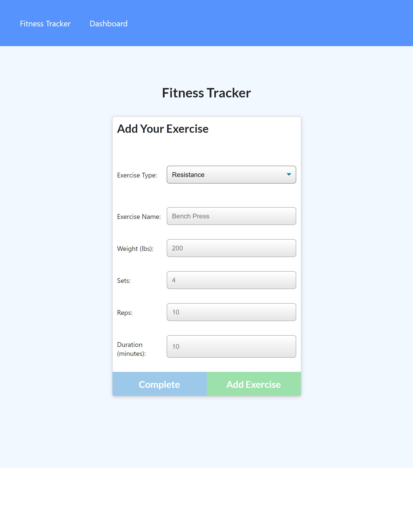

# Fitness Tracker 
   
  ===========================================
    
  ## Description 
      This tracker tracks the name, type, weight, set, reps, and duration of excersises that are stored using a Mongo database and express for routing.  
  ## Table of Contents 
  - [Installation](#installation)
  - [Usage](#usage)
  - [Contributions](#contributions)
  - [Tests](#tests)
  - [Questions](#questions)
  - [License](#license)
  ## Installation 
      No installation is nessisary.  This application has been deployed on Heroku
  ## Usage 
      The user will be presented on the loading of the page with the information from their last workout if it exists.  They will be given the option of adding additional exercises to this previous workout or to begin a new workout.  Upon choosing, they will then reach the exercise page where they can enter the specifics of new exercises.  They can also view the stats of past workouts on their dashboard page that brings up the complete info from the last 7 workouts.  

  ## Contributions 
      The back-end of this app was created by:
* KellyJohnson364: [https://github.com/KellyJohnson364](https://github.com/KellyJohnson364)
            
            
            
         
           

   

  ## Questions 
If you have questions or feedback, please contact KellyJohnson364 at [https://github.com/KellyJohnson364](https://github.com/KellyJohnson364) or via email at KJ3641402@gmail.com	.

## License
This project is licensed under MIT License.
For more info click [MIT License](./assets/licenses/mitlicense.md).